<div align="center">


**Drive 55 security tools through one phased assessment — and never fire an exploit by accident.**

[](LICENSE)
[](#-tests)

[](#-install)
[](#-install)
[](#-the-five-phases)
[](#-the-stack-it-drives)
[](KALI.md)
[](#-control-frameworks)

</div>

<br>

<div align="center">

**32 stages · 6 phases · 55 tools orchestrated ·  tests across 26 suites · no runtime dependencies**

</div>

<br>

<div align="center">



</div>

---

## 📑 Table of Contents

- [What is Vision](#-what-is-vision)
- [The Stack It Drives](#-the-stack-it-drives)
- [Console](#-console)
- [Install](#-install)
- [Feature Overview](#-feature-overview)
- [The Five Phases](#-the-five-phases)
- [Scan Intensity](#-scan-intensity)
- [Exploit Policy](#-exploit-policy)
- [Working With Results](#-working-with-results)
  - [7. Manual playbook](#7-manual-playbook)
  - [8. Recording manual findings](#8-recording-manual-findings)
  - [1. Live findings](#1-live-findings)
  - [2. Remediation plan](#2-remediation-plan)
  - [3. Triage](#3-triage)
  - [4. Attack paths](#4-attack-paths)
  - [5. Custom rules](#5-custom-rules)
  - [6. Reports, retests & resume](#6-reports-retests--resume)
- [Control Frameworks](#-control-frameworks)
- [Commands](#-commands)
- [Evidence & Audit](#-evidence--audit)
- [Tests](#-tests)
- [Documentation](#-documentation)
- [Scope & Responsible Use](#-scope--responsible-use)
- [License](#-license)

---

## 🧠 What is Vision

**Vision** is a network VAPT orchestrator. It drives 55 existing security tools
through a five-phase assessment, normalises everything into one finding model,
chains findings into attack paths, maps them to control frameworks, and produces
a client-ready report with a remediation plan.

It recommends exploits. **It never fires one on its own.**

That last sentence is the whole design. The demo above ends where most tools
would start bragging — on a refusal, and on a prompt that makes you type the
target's IP before anything touches it.

Five of the thirty-two stages need no external tool at all, so a box with only nmap
installed still produces real findings.

---

## 🧰 The Stack It Drives

<div align="center">



</div>

---

## 🛰️ Console

The interactive console reads like a cockpit — systems check on boot, phase
callsigns, live telemetry:

```
  ── systems check ──
  ▪ scope containment   engagement boundary armed
  ▪ sensor array        toolchain resolved
  ▪ payload interlocks  exploit gates engaged
  ▪ flight recorder     run log open

╭─ PROBE [3/6] Deep Enumeration
│  shares, directories, datastores
╰──────────────────────────────────────────────────────────────
```

**The report does not.** Findings, severities and remediation stay in plain
professional language, because a client deliverable that says *"HOSTILE
CONTACT"* instead of *"unauthenticated Redis instance"* is worse at its job. A
test asserts no console vocabulary reaches the report.

---

## 🖥️ Install

```bash
unzip vision.zip && cd vision
./install.sh --system      # venv, deps, -test self-check, `vision` on PATH
vision
```

That is the whole setup. Vision checks what it needs, offers to install missing
tools and build the Metasploit index **inline**, then walks you through target
and intensity.

```
▸ Readiness  41/55 tools installed
  ✗ missing core tools: nuclei, metasploit
  Install them now? [Y/n]
  ! no Metasploit module index — exploit advisory unavailable
  Build it now? (about 10 seconds) [Y/n]

  Start a new assessment? [Y/n]
```

Previously this was four separate commands, and you only discovered the index
was missing after the advisory came back empty. Anything fixable is now offered
where the problem is found.

Kali is the best-supported platform — see **[KALI.md](KALI.md)** for VM setup
and the network configuration that actually matters. Ubuntu, Debian, Parrot and
macOS work too; `setup` picks the right package manager per tool.

---

## ✨ Feature Overview

<table>
<tr>
<td width="50%" valign="top">

**🎯 One Command, Start to Finish**
`vision` runs a readiness check, fixes what's missing, then walks you through
target and intensity — no four-command setup ritual.

**📡 Live Findings & Full Command Visibility**
Every command is printed as it runs, each stage explains what it's trying in
plain language, and findings announce themselves the moment they're found — with
a progress bar, elapsed time and an estimate of what's left.

**🔧 Manual Testing Playbook**
Vision automates what should be automated. For everything else it hands you the
commands a competent analyst would run next, per service and per finding, ready
to paste — with intrusive ones flagged.

**✎ Record What You Find By Hand**
Whatever you turn up manually goes straight into the same report, remediation
plan and attack-path correlation — labelled as analyst work, never disguised as
tool output.

**🧮 Remediation Plan**
13 findings reduce to 6 actions. The unit of work is the *change*, not the
finding — "Enforce SMB signing" is one job, not seven.

**🔗 Attack Paths**
Ten built-in chains turn isolated findings into exploitation narratives, capped
by their weakest load-bearing evidence.

**🏷️ Triage**
Mark findings confirmed, false-positive or accepted-risk. Exclusions require a
reason and are **disclosed in an appendix**, never dropped.

**📊 Control Mapping**
Every finding mapped to MITRE ATT&CK, CIS v8, PCI DSS v4.0 and OWASP Top 10 —
indicative, and clearly labelled as such.

</td>
<td width="50%" valign="top">

**🔧 Run Tools By Hand, Tracked**
Pick any installed tool, start from a playbook command, edit and run it inside
Vision. Scope-checked, logged to the same run log as automated stages, output
saved as evidence, and one keystroke to record a finding from it.

**🎯 Exactly the Targets You Give**
A single IP scans one address, and the plan states the count before anything
runs. Target files work everywhere: comments, ranges and separators handled, bad
lines reported by line number rather than fatal.

**⏱️ Know What It Will Cost**
The scan plan states an estimated runtime before you commit, calibrated against
measured runs, and names the stages worth skipping — in a reference run
`nuclei` alone was two thirds of the total.

**🔍 Coverage, Not Just Findings**
A finding count says nothing about whether every service was looked at. Vision
reports what percentage of discovered services an assessment stage actually
covered, and names the ones it did not — seen, but neither a finding nor a
clean result.

**📋 A Deliverable, Not a Scan Dump**
Client, assessor, authorisation reference and dates on the front page, and an
executive summary written for whoever decides whether to fund the fix. Vision
drafts it from what it actually found — and labels it a draft, so nobody ships
machine-written prose unread.

**🔑 Authenticated Assessment**
Hand Vision the account the client gave you and it finds what no anonymous scan
can: where that account is local admin, what an ordinary user can read, the real
password policy, Kerberoastable service accounts. **Credentials never touch
disk** — not the state file, the run log, the evidence directory or the report.

**⚡ Batched Verification**
`check` runs every candidate in one msfconsole session instead of one boot
each — verifying fifteen findings drops from ~10 minutes of framework startup
to one. Exploitation stays strictly one target at a time.

**👁️ See What Every Tool Is Doing**
Every stage streams its tool's output as it happens — the way `nmap -v` does
when you run it by hand. "Discovered open port 445/tcp", "Completed SYN Stealth
Scan", a nuclei template match: visible while it happens, not after the tool
finishes. A slow tool and a stuck one look completely different.

**📡 Live Exploit Progress**
No more watching a number climb with no idea if anything is happening. Vision
reads msfconsole's output as it prints it and shows the actual phase —
connecting, sending the exploit, sending the payload, session opened — not
just elapsed seconds.

**🎯 Proof of Impact**
When an exploit opens a session, Vision captures the identity obtained, records
a confirmed finding with the transcript as evidence, and closes the session. A
report that says *"root shell obtained, uid=0(root)"* is not the same document
as one that says *"the version looks vulnerable"*.

**🔒 Gated Exploitation**
No autonomous firing, no batch mode, scope re-validated at fire time, and
confirmation is typing the target IP — not `y`.

**🎚️ Three Intensities**
Stealth, normal, aggressive. Each states its impacts *before* running, itemised
rather than summarised.

**📄 Self-Contained Reports**
HTML, JSON, Markdown, CSV. The HTML report is one file — no CDN, no JavaScript
— because it gets emailed, opened air-gapped, and printed to PDF.

**♻️ Retest Diff**
Compare a retest to a baseline. Findings match on host, port and CVE rather
than wording, so a re-rated finding isn't counted as one fixed plus one new.

**🧾 Evidence & Audit**
Raw tool output saved per stage; every command logged with argv, exit code and
stderr — credentials redacted, tool-aware so nmap port lists stay readable.

**💾 Session Resume**
Quitting no longer discards work. On start, Vision offers to reload the last run
— triage decisions included.

</td>
</tr>
</table>

---

## 🧭 The Five Phases

Thirty-two stages, each skipped cleanly when its tool is absent.

| | Phase | Stages |
| :-: | :-- | :-- |
| **1** | 🔍 Reconnaissance | Host discovery |
| **2** | 🛰️ Service Enumeration | TCP scan, supplementary high-value ports, banner rules, targeted UDP |
| **3** | 🗝️ Deep Enumeration | SMB, shares, RPC, SNMP, NFS, LDAP, IKE, datastores |
| **4** | 🔑 Authenticated Assessment | Admin sprawl, share access, password policy, Kerberoasting |
| **5** | 🌐 Web Assessment | Security headers, exposed paths, TLS certificates |
| **6** | 🎯 Vulnerability Assessment | TLS posture, Exploit-DB, nuclei, deep TLS, NSE scripts |

<details>
<summary><b>Why a supplementary port scan?</b></summary>

<br>

nmap's top-1000 does not include Redis (6379), Memcached (11211), MongoDB
(27017), the Docker API (2375) or Kubelet (10250). Without covering them the
`datastore-exposure` stage could not fire in the default profile — it would
report *"no datastore services found"* on a network with all three exposed.

A second short scan covers fifteen such ports. A test recomputes nmap's
top-1000 from `nmap-services` and fails if any stage keys on a port nothing
scans.

</details>

---

## 🎚️ Scan Intensity

Depth is *which stages run*. Intensity is *how hard each one pushes*. They are
separate questions, and conflating them hides the trade-off.

| | Ports | Rate | Probes | Use when |
| :-- | :-- | :-- | :-- | :-- |
| 🥷 **Stealth** | top 200 | 100 pkt/s | intensity 2 | Detection is in scope, or the target is fragile |
| ⚖️ **Normal** | top 1000 + extras | 1000 pkt/s | intensity 7 | Default for most engagements |
| 🔥 **Aggressive** | all 65535 | 5000 pkt/s | intensity 9 | Maximum findings, with written authorisation |

Every profile states its impacts before running. Aggressive declares three
serious ones and makes you type `AGGRESSIVE` rather than press `y`:

> ⚠️ **Intensive service probing can crash fragile targets.** Printers, IP
> cameras, VoIP handsets, building-management controllers and industrial
> equipment are known to hang or reboot under it. This is the most common way an
> assessment causes an outage — and it happens during *scanning*, not
> exploitation.

Stealth discloses its own cost too: it misses services outside the top 200
ports, so a clean result there is not evidence of a clean network.

**Intensity never relaxes a gate.** Turning coverage up does not turn
confirmation off — the exploit launcher has no knowledge of scan profiles at
all, and a test asserts it.

---

## 🔒 Exploit Policy

The tool recommends; the analyst decides. Unattended exploitation wrecks client
boxes and breaks scope agreements. Enforced **in code, not documentation**:

| | Gate |
| :-: | :-- |
| 🚫 | **No autonomous firing.** Nothing runs as a side effect of scanning, correlation, or reporting. |
| 1️⃣ | **No batch mode.** One module, one target, one confirmation. There is deliberately no `exploit_all()`. |
| 🎯 | **Scope re-validated at fire time**, never inherited from imported data. |
| ✅ | **`check` before `exploit`.** Modules that verify without delivering a payload rank highest. |
| 🔐 | **Destructive modules visible but locked.** Hiding MS17-010 would leave you blind; firing it unasked takes down a production host. |
| ⌨️ | **Confirmation is typing the target IP**, not `y`. Muscle-memory `y` is how the wrong box gets hit. |
| 📝 | **Append-only 0600 audit log** of every planned, executed *and refused* action. A refusal is the evidence the gates held. |

---

## 📈 Working With Results

### 1. Live findings

```
  [7/13] datastore-exposure
    CRITICAL 192.168.56.104:6379   Redis exposed without authentication
              +PONG  ·  no credential required
    HIGH     192.168.56.104:11211  Memcached exposed without authentication
```

Only medium and above are announced — surfacing every informational banner would
bury the two lines that matter under forty that don't.

### 2. Remediation plan

```
▸ Remediation plan   13 findings reduce to 6 actions
  #   WORST     HOSTS  FIXES  ACTION
  1   critical  1      1      Set requirepass and bind Redis to localhost
  2   high      3      3      Restrict Telnet to trusted networks

  one change, several hosts
    3 hosts   Restrict Telnet to trusted networks
```

Severity dominates the ordering; breadth orders within a tier. Ranking purely on
summed weight would put three Telnet findings above an unauthenticated Redis
instance, and no assessor hands a client a plan that ranks a critical below a set
of highs.

**Effort is not estimated.** Vision cannot know whether a host is a spare VM or a
production controller with a six-week change process.

### 3. Triage

Mark any finding confirmed, false-positive or accepted-risk. Excluding one
**requires a reason**, and excluded findings are **disclosed in an appendix** —
a report that silently omits findings is indistinguishable from a scan that
missed them.

Decisions key on host, port and CVE, so they survive a rescan.

### 4. Attack paths

An exposed `.env` is a medium on its own. On a host that also runs a reachable
database, it is a straight line to the data.

```
1. CRITICAL  Unauthenticated SYSTEM via MS17-010 on 10.0.0.6
     outcome    SYSTEM-level code execution without credentials
     confidence confirmed
```

A chain is only as confident as its weakest *load-bearing* step, and one built
entirely on tentative evidence is capped at medium — it describes a possibility,
not a finding.

### 5. Custom rules

```json
{
  "chains": [{
    "id": "acme.legacy-appliance",
    "severity": "high",
    "steps": [
      {"label": "Unsupported firmware", "title": "Outdated .*ApplianceOS"},
      {"label": "Management reachable", "port": [443, 8443],
       "load_bearing": false}
    ],
    "remediation": "Replace the appliance or isolate its management interface."
  }]
}
```

Files in `~/.vision/rules/` load automatically. Rule files are **data, never
code** — no `eval`, no import hook, no callable field.

### 7. Manual playbook

```
  6379/tcp  redis
    Confirm unauthenticated access
      $ redis-cli -h 10.0.0.5 -p 6379 INFO
      If INFO answers, the keyspace is readable by anyone.
    Check whether CONFIG is reachable ⚠
      $ redis-cli -h 10.0.0.5 -p 6379 CONFIG GET dir
      CONFIG SET is the step that turns read access into file write.
```

Vision automates the parts of an assessment that *should* be automated. The part
where an analyst sits down with a shell is not one of them, and a tool that says
"assessment complete" is claiming the easy half is the whole job.

So the boundary is marked rather than hidden. Every service and finding carries
the hands-on commands worth running next, with the reason for each. Steps marked
⚠ are intrusive — that judgement belongs to you, not the tool.

**Vision never runs any of them.** A test asserts the playbook module contains no
`subprocess`, and that credential-attack suggestions ship commented out so they
can't land in a shell buffer ready to fire.

### 8. Recording manual findings

The playbook says what to run. This is where the result goes.

```
▸ Record a manual finding   what you found by hand, in your own words
  target IP> 10.0.0.5
  port> 445
  title> Domain admin via unconstrained delegation
  Severity> 1   Critical
  How sure are you?> 1   Confirmed — you verified it yourself
  Evidence — paste the output that proves it.
  > Obtained TGT for DC01$ using printerbug
```

It flows into the report, the remediation plan and attack-path correlation like
any other finding — and stays **visibly marked as analyst work**. A reviewer asks
different questions of a tool finding than of a human one, so hiding the
difference would make the report harder to check, not easier.

Scope is enforced here too. An engagement boundary that applies to the scanner
but not to the keyboard is not a boundary.

### 6. Reports, retests & resume

```
╭─ delta ──────────────╮
│ resolved     3       │
│ new          1       │
│ remediation  60%     │
╰──────────────────────╯
  ! 1 new high/critical finding(s) since the baseline
```

See **[docs/sample-report.html](docs/sample-report.html)** for an example
deliverable — open it in a browser.

---

## 📊 Control Frameworks

Every finding is mapped to the controls an assessor would actually cite:

| Framework | Version |
| :-- | :-- |
| MITRE ATT&CK | Enterprise |
| CIS Critical Security Controls | v8 |
| PCI DSS | v4.0 |
| OWASP Top 10 | 2021 |

**This is indicative, not an audit.** A mapping says *"this finding is evidence
relevant to that control"*, which is what an assessment report needs. It is not a
compliance determination — that requires defined scope, compensating controls,
and a qualified assessor. Both the CLI and the report say so explicitly.

---

## ⌨️ Commands

| Command | |
| :-- | :-- |
| `vision` | Interactive console — the primary interface |
| `vision doctor` | Audit the toolchain and report capabilities, not just binaries |
| `vision setup` | Install what's missing, via Kali metapackages where available |
| `vision index` | Build the offline Metasploit module index |
| `vision run` | Automated assessment, stopping at the advisory |
| `vision paths` | Chain findings into attack paths |
| `vision frameworks` | Map findings to ATT&CK, CIS, PCI DSS, OWASP |
| `vision diff` | Compare a retest against a baseline |
| `vision advise` | Ranked exploit recommendations |
| `vision exploit` | Interactive verify or execute, one target at a time |

---

## 🧾 Evidence & Audit

Every finding carries the tool that reported it, a confidence rating, evidence,
and remediation. **Confidence is shown rather than hidden**: `tentative` means
inferred from a banner and not verified, and the report says so in plain
language. A report that overstates certainty is worse than one with fewer
findings.

```bash
jq -c 'select(.returncode != 0)' vision-run/run.jsonl   # what failed and why
ls vision-run/evidence/smb-shares/                      # raw tool output
```

An empty result is reported honestly. *"No findings"* is ambiguous, so Vision says
which stages ran, which did not, and why — a clean result with half the toolchain
missing is not full coverage.

---

## 🧪 Tests

```bash
./run_tests.sh
```

** tests across 26 suites** plus 25 documentation checks, run automatically
by `install.sh` so a broken install surfaces immediately rather than
mid-engagement.

`test_realworld` runs against output captured from a live Metasploitable 2
host. That run found four bugs no synthetic test had caught — including a
timeout being reported as a clean result, and a single CVSS score being applied
to every CVE in a block, which produced 148 criticals on one host.

The most useful ones are not per-feature. Several bugs were *invariant
violations* that every individual stage's own tests passed straight through — a
stage that skipped the scope check, one that probed serially while its siblings
ran concurrently, one whose findings carried no remediation. Those invariants are
asserted across the whole stage registry, and were verified by deliberately
breaking each one to confirm the suite catches it.

`test_docs` recomputes the stage count, tool count, test count and command list
from the code and fails if any document contradicts them — so the numbers on this
page cannot quietly go stale.

---

## 📚 Documentation

| | |
| :-- | :-- |
| 📖 [MANUAL.md](MANUAL.md) | Full usage, every command and flag |
| 🐉 [KALI.md](KALI.md) | VM setup, and the network config that actually matters |
| 🧪 [lab/LAB.md](lab/LAB.md) | Setting up a legal target to test against |
| 🛡️ [SECURITY.md](SECURITY.md) | Threat model, and how Vision defends itself |
| 📄 [docs/sample-report.html](docs/sample-report.html) | An example deliverable |

---

## 🔒 Scope & Responsible Use

> **Only scan systems you own or have written authorisation to test.**

Unauthorised scanning is a criminal offence in most jurisdictions — the Computer
Fraud and Abuse Act, the Computer Misuse Act, and sections 43 and 66 of the IT
Act 2000. *"I was testing my tool"* is not a defence.

Vision enforces what it can: scope is hard-enforced at every stage, `--rfc1918-only`
refuses public addresses outright, a public target in the console requires typing
`CONFIRM`, and the aggressive profile requires written authorisation it asks you
to acknowledge.

What it cannot enforce is whether you actually have permission.
**[lab/LAB.md](lab/LAB.md)** covers building a target you are allowed to attack —
Metasploitable on a host-only adapter, and the network configuration that keeps
it isolated.

---

## 📜 License

Released under the **[MIT License](LICENSE)**.

You may use, modify and distribute it freely, including commercially. It is
provided without warranty — and given what it does, that disclaimer is not
boilerplate. Read [SECURITY.md](SECURITY.md) before pointing it at anything you
care about.

<div align="center">
<br>

**verify before you fire**

</div>
